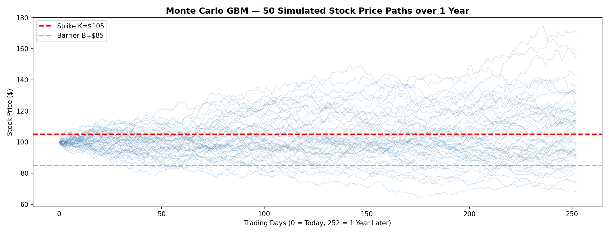
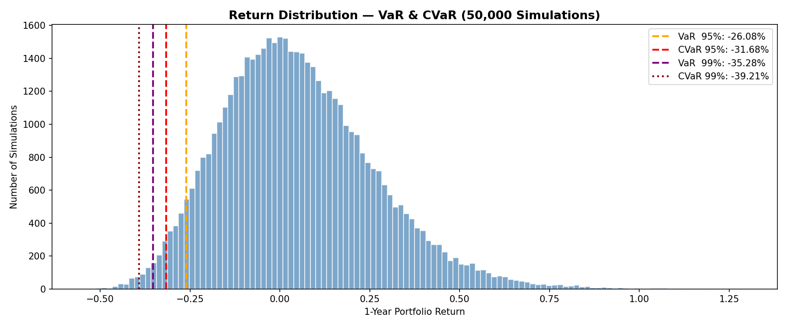
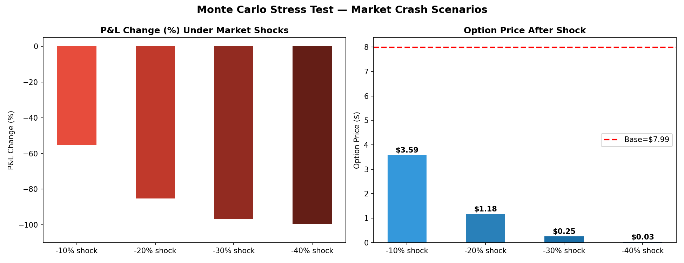

# Monte Carlo Options Pricer & Stress Tester

A Python implementation of **Monte Carlo simulation** for pricing European, Asian,
and Barrier options with full risk analytics including VaR, CVaR, and stress testing.

---

## Concept

The Monte Carlo method simulates thousands of possible price paths for an underlying
asset using **Geometric Brownian Motion (GBM)**:

```
dS = mu * S * dt  +  sigma * S * dWt
```

Where:
- `S`     = asset price
- `mu`    = drift (risk-free rate)
- `sigma` = volatility
- `Wt`    = Wiener process (random Brownian motion)

The option price is estimated as the discounted expected payoff:

```
C = exp(-r * T) * average[ max(ST - K, 0) ]
```

For exotic options:
- **Asian option** — payoff uses average price over entire path (cheaper)
- **Barrier option** — cancelled or activated if price crosses barrier level B

---

## Results (50,000 Simulations)

### Option Prices
| Option Type       | MC Price |
|-------------------|----------|
| European Call     | $7.99    |
| European Put      | $7.93    |
| Asian Call        | $3.50    |
| Barrier Down-Out  | $7.74    |
| Barrier Down-In   | $0.25    |

### Risk Metrics
| Metric      | Value   |
|-------------|---------|
| 95% VaR     | -26.08% |
| 95% CVaR    | -31.68% |
| 99% VaR     | -35.28% |
| 99% CVaR    | -39.21% |

### Stress Test
| Scenario   | Option Price | P&L Change |
|------------|-------------|------------|
| -10% shock | $3.59       | -55.08%    |
| -20% shock | $1.18       | -85.22%    |
| -30% shock | $0.25       | -96.87%    |
| -40% shock | $0.03       | -99.64%    |

---

## Output Charts

### GBM Simulated Price Paths


### VaR and CVaR Return Distribution


### Stress Test Results


---

## Features

- 50,000 GBM Monte Carlo price path simulations
- European Call and Put option pricing
- Asian option pricing (path-dependent, average price)
- Barrier option pricing (Down-and-Out and Down-and-In)
- Value at Risk (VaR) at 95% and 99% confidence levels
- Conditional VaR / Expected Shortfall (CVaR) — Basel III standard
- Stress testing under -10% to -40% market crash scenarios

---

## Tech Stack


---

## Project Structure

```
monte-carlo-options-pricer/
│
├── main.py              <- Run full simulation
├── src/
│   ├── gbm_simulator.py <- GBM price path engine
│   ├── option_pricer.py <- European, Asian, Barrier pricing
│   └── risk_metrics.py  <- VaR, CVaR, Stress Testing
├── results/             <- Output charts (auto-generated)
├── requirements.txt
├── .gitignore
└── README.md
```

---

## How to Run

```bash
git clone https://github.com/venkatasai365/monte-carlo-options-pricer
cd monte-carlo-options-pricer
pip install -r requirements.txt
python main.py
```

Charts save automatically to `results/` folder.

---

## Key Parameters

| Parameter | Value    | Description          |
|-----------|----------|----------------------|
| S0        | $100     | Initial stock price  |
| K         | $105     | Strike price         |
| B         | $85      | Barrier level        |
| r         | 5%       | Risk-free rate       |
| sigma     | 20%      | Volatility           |
| T         | 1 year   | Time to expiry       |
| n_sim     | 50,000   | Number of simulations|

---

## Author

**Venkatasai Thaduri**
NISM Equity Derivatives Certified (2026) | Junior Quantitative Analyst

[](https://linkedin.com/in/venkatasai-thaduri)
[](https://github.com/venkatasai365)
